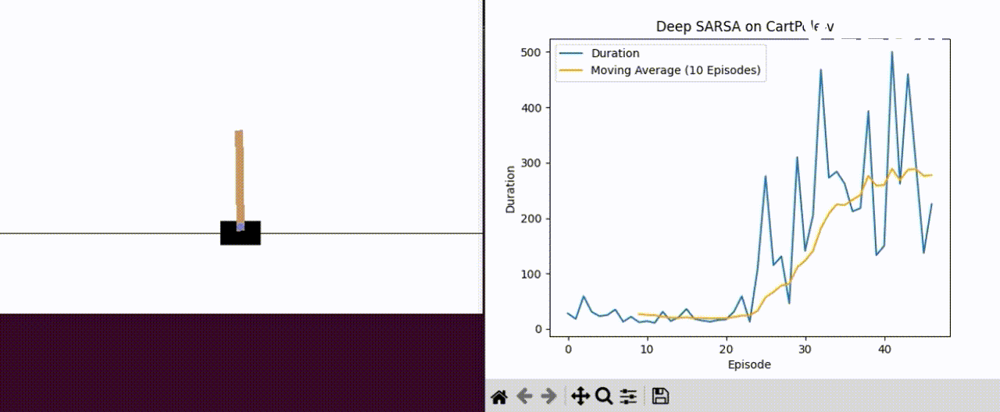
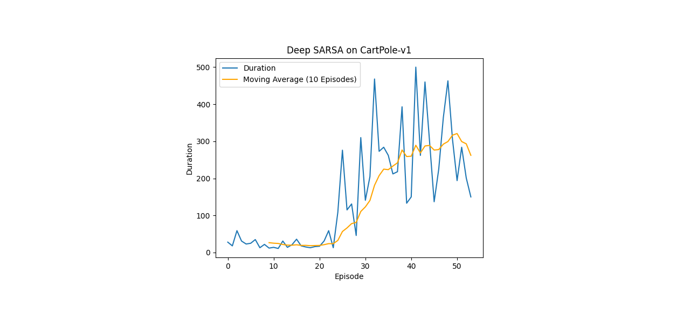

# Deep SARSA Reinforcement Learning Agent
[](https://github.com/frederikgram/deep-sarsa-cartpole/blob/master/LICENSE)

## About
In this project, a simple implementation of a Deep SARSA reinforcement learning agent is shown, specifically, an implementation which uses Replay Buffers to learn from experience. While this is not typical for on-policy agents, it is generally considered an acceptable
trade-off in the context of Deep SARSA.

The agent is trained to play the game of CartPole, which is a simple game where the agent must balance a pole on a cart. The agent is rewarded for each time step that the pole remains balanced, and is penalized for each time step that the pole falls over. The agent is considered to have solved the game when it can balance the pole for 500 time steps.

## Requirements
```bash
$ python3 -m venv venv
$ source venv/bin/activate
$ pip install -r requirements.txt
```

## Usage
```bash
$ python3 agent.py
```


## Performance

The agent was trained for 100 episodes, and the results are shown below.
<p align="center">


</p>

## Hyperparameters
```python
gamma = 0.9,
epsilon = 1.0,
batch_size = 32,
epsilon_min = 0.01,
memory_size = 10000,
learning rate = 0.01,
epsilon_decay = 0.9995,
```

## Performance

The agent was trained for 100 episodes, and the results are shown below. It should be noted that the volatility in the duration post episode 40 is primarily caused by the lower bound of `epsilon = 0.01`, making one percent of all actions taken completely random.
<p align="center">

</p>

